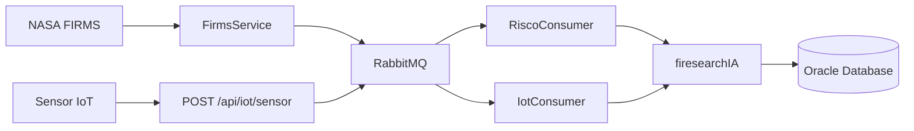

# 🔥 FireSearch Logic


Sistema distribuído para monitoramento e classificação de risco de incêndios florestais utilizando dados reais da NASA FIRMS, sensores IoT e Machine Learning.

Projeto desenvolvido para a **Global Solution 2026/1** da FIAP no curso de Análise e Desenvolvimento de Sistemas.

---

## 📋 Sobre o Projeto

O FireSearch é uma solução voltada para prevenção e monitoramento de incêndios florestais.

A plataforma integra:

* 🌎 Dados reais da NASA FIRMS
* 📡 Sensores IoT
* 🤖 Modelo de Machine Learning
* 📨 Processamento assíncrono com RabbitMQ
* 🔐 Autenticação via Firebase JWT
* 🗄️ Persistência Oracle Database

O objetivo é identificar regiões com potencial risco de incêndio e gerar alertas para tomada de decisão antecipada.

---

## 👥 Equipe

| RM       | Nome                  | Responsabilidade                  |
| -------- | --------------------- |-----------------------------------|
| RM553043 | Daniel Kendi          | API .NET, Oracle DDL e Firebase   |
| RM560179 | Lucas da Ressurreição | API Java e Machine Learning       |
| RM560560 | Jonas Kimio           | Mobile React Native               |
| RM560475 | Marcos Vinicius       | DevOps e CI/CD, Quality Assurance |

---

## 🏗️ Arquitetura



---

## 🚀 Tecnologias Utilizadas

### Backend

* Java 21
* Spring Boot 3.5
* Spring Security
* Spring Data JPA
* Spring AMQP
* Maven

### Infraestrutura

* Oracle Database
* RabbitMQ (CloudAMQP)
* Firebase Authentication
* Swagger / OpenAPI

### Inteligência Artificial

* Python
* Flask
* Scikit-Learn

---

## ⚙️ Funcionalidades

### Monitoramento de Regiões

* Cadastro de regiões monitoradas
* Consulta de regiões cadastradas
* Remoção de regiões

### Integração NASA FIRMS

* Importação automática de focos de calor
* Consulta diária agendada
* Armazenamento histórico

### Processamento de Risco

* Integração com modelo de Machine Learning
* Classificação automática de risco
* Histórico de análises

### IoT

* Recebimento de leituras de sensores
* Processamento assíncrono
* Geração de alertas

### Segurança

* Validação JWT Firebase
* Controle de acesso via Spring Security

---

## 🔗 Endpoints Principais

| Método | Endpoint                          | Descrição                 |
| ------ | --------------------------------- | ------------------------- |
| GET    | `/api/regioes`                    | Lista regiões monitoradas |
| POST   | `/api/regioes`                    | Cadastra nova região      |
| DELETE | `/api/regioes/{id}`               | Remove região             |
| GET    | `/api/alertas`                    | Lista alertas             |
| GET    | `/api/alertas/nivel/{nivel}`      | Filtra alertas por nível  |
| GET    | `/api/focos`                      | Lista focos de calor      |
| GET    | `/api/historico-risco`            | Histórico de riscos       |
| GET    | `/api/historico-risco/alto-risco` | Regiões críticas          |
| POST   | `/api/iot/sensor`                 | Recebe leitura IoT        |

---

## 🔥 Fluxo NASA FIRMS

1. O `FirmsService` executa diariamente às **06h00**.
2. A aplicação consulta a API NASA FIRMS.
3. Os focos de calor são persistidos no Oracle.
4. Os eventos são publicados no RabbitMQ.
5. O `RiscoConsumer` consome as mensagens.
6. A `firesearchIA` calcula o score de risco.
7. O resultado é armazenado no banco.

---

## 📡 Fluxo IoT

1. O sensor envia dados para:

```http
POST /api/iot/sensor
```

2. A leitura é enviada para o RabbitMQ.
3. O `IotConsumer` processa a mensagem.
4. A `firesearchIA` realiza a classificação.
5. Alertas são gerados para a região monitorada.

---

## 🛠️ Configuração

Crie o arquivo:

```text
src/main/resources/application.properties
```

Utilizando o modelo abaixo:

```properties
# Oracle Database
spring.datasource.url=jdbc:oracle:thin:@oracle.fiap.com.br:1521:orcl
spring.datasource.username=SEU_RM
spring.datasource.password=SUA_SENHA

# Firebase JWT
jwt.issuer=https://securetoken.google.com/SEU_PROJETO_FIREBASE

# RabbitMQ
spring.rabbitmq.host=SEU_HOST
spring.rabbitmq.port=5672
spring.rabbitmq.username=SEU_USUARIO
spring.rabbitmq.password=SUA_SENHA

# Machine Learning
firesearch.ia.url=https://firesearchia.onrender.com

# NASA FIRMS
firms.api.key=SUA_API_KEY
```
---
## Scripts de Banco e Infraestrutura

Os scripts de criação do banco Oracle e provisionamento da infraestrutura Azure estão documentados em:

📁 [scripts/README.md](scripts/README.md)

---

## ▶️ Executando o Projeto

```bash
git clone https://github.com/seu-repositorio/firesearchlogic.git

cd firesearchlogic

mvn clean install

mvn spring-boot:run
```

---

## 📖 Documentação da API

Após iniciar a aplicação:

```text
http://localhost:8080/swagger-ui/index.html
```

---

## 🎯 Diferenciais do Projeto

* Dados reais da NASA FIRMS
* Arquitetura orientada a eventos
* Integração com Machine Learning
* Segurança baseada em Firebase JWT
* Processamento assíncrono com RabbitMQ
* Ambiente corporativo utilizando Oracle Database

---

## 📚 Estrutura do Ecossistema FireSearch

| Componente          | Responsável | Tecnologia         |
| ------------------- | ----------- | ------------------ |
| API Principal       | Lucas       | Java + Spring Boot |
| IA de Classificação | Lucas       | Python + Flask     |
| API de Autenticação | Daniel      | .NET + Firebase    |
| Aplicativo Mobile   | Jonas       | React Native       |
| DevOps e Pipeline   | Marcos      | Docker + CI/CD     |

---

## Links dos Repositórios de outras matérias:

* IOT: [Repository](https://github.com/Lucas2000-student/firesearchIA)
* .NET: [Repository](https://github.com/DanKendi/SentinelLoginApi)
* Front: [Repository](https://github.com/JonasKimio/SENTINELA)

---

**FIAP — Análise e Desenvolvimento de Sistemas — Global Solution 2026/1**
